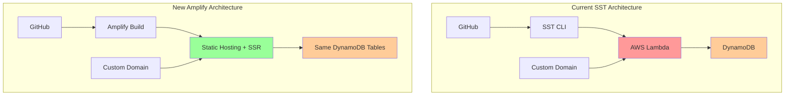

# Migration Plan: SST to AWS Amplify

## Overview
This document outlines the migration strategy from SST (ServerlessStack) to AWS Amplify Hosting for the Johnson Family Super Bowl application while preserving all existing DynamoDB data and functionality.

## Current Architecture Analysis

### Existing Setup
- **Framework**: Next.js 16 with App Router
- **Infrastructure**: SST v3 with AWS Lambda
- **Database**: DynamoDB (2 tables in us-west-1)
  - `SuperBowlEntries` - Main competition entries
  - `WinningEntry` - Annual winning entries
- **Domain**: `johnsonfamilysuperbowl.com` (production)
- **AWS SDK**: Direct DynamoDB integration with proper error handling

### Current Issues with SST
- Deployment complexity and reliability issues
- Lambda cold starts affecting performance
- SST framework maintenance overhead
- Build and deployment inconsistencies

## Migration Strategy: AWS Amplify Hosting

### Why AWS Amplify?
1. **Zero Code Changes**: Existing DynamoDB integration remains unchanged
2. **Simplified Deployment**: Git-based CI/CD pipeline
3. **Better Performance**: Edge caching and faster cold starts
4. **Cost Optimization**: No Lambda function charges
5. **Domain Management**: Built-in custom domain support
6. **Environment Management**: Easy staging and production environments

### Architecture Comparison



## Migration Steps

### Phase 1: Pre-Migration Setup
1. **Backup Current Deployment**
   - Document current environment variables
   - Export DynamoDB table schemas and data
   - Verify current domain configuration

2. **AWS IAM Setup**
   - Create dedicated IAM user for Amplify
   - Configure DynamoDB access policies
   - Set up service role for Amplify

3. **Repository Preparation**
   - Ensure clean main branch
   - Remove SST-specific files from build process
   - Update environment variable structure

### Phase 2: Amplify Configuration

1. **Amplify App Setup**
   - Connect GitHub repository to Amplify
   - Configure build settings for Next.js
   - Set up environment variables for production/staging

2. **Build Configuration**
   ```yaml
   # amplify.yml (to be created)
   version: 1
   applications:
     - frontend:
         phases:
           preBuild:
             commands:
               - npm ci
           build:
             commands:
               - npm run build
         artifacts:
           baseDirectory: .next
           files:
             - '**/*'
         cache:
           paths:
             - node_modules/**/*
   ```

3. **Environment Variables**
   - `AWS_REGION`: us-west-1
   - `NODE_ENV`: production/development
   - DynamoDB table names (if configurable)

### Phase 3: Testing and Validation

1. **Staging Environment**
   - Deploy to Amplify staging branch
   - Test all CRUD operations with DynamoDB
   - Verify form submissions and data retrieval
   - Test admin functionality

2. **Performance Testing**
   - Compare page load times
   - Test database connectivity
   - Verify error handling

3. **Data Integrity Verification**
   - Confirm all existing entries are accessible
   - Test new entry creation
   - Verify winning entry functionality

### Phase 4: Production Deployment

1. **Domain Migration**
   - Configure custom domain in Amplify
   - Update DNS records
   - Set up SSL certificate (automatic)

2. **Go-Live Process**
   - Deploy to production branch
   - Monitor application health
   - Verify all functionality

3. **Post-Deployment**
   - Remove SST infrastructure
   - Update documentation
   - Clean up unused resources

## File Changes Required

### Files to Modify
- [`package.json`](package.json) - Update deployment scripts
- [`next.config.ts`](next.config.ts) - Remove SST-specific configurations
- [`README.md`](README.md) - Update deployment instructions

### Files to Create
- `amplify.yml` - Amplify build configuration
- `.env.example` - Environment variable template
- `deployment-guide.md` - New deployment instructions

### Files to Remove (Post-Migration)
- [`sst.config.ts`](sst.config.ts)
- `sst-env.d.ts`
- SST-related dependencies from package.json

### Files Unchanged
- All [`src/`](src/) directory files remain identical
- [`src/data/index.ts`](src/data/index.ts) - DynamoDB integration stays the same
- [`src/data/database-service.ts`](src/data/database-service.ts) - No changes needed
- All React components and pages
- Styling and configuration files

## Cost Analysis

### Current SST Costs
- Lambda function invocations
- CloudFront distribution
- Route 53 hosting
- SST infrastructure overhead

### New Amplify Costs
- Amplify hosting (build minutes + serving)
- DynamoDB operations (unchanged)
- Route 53 DNS (unchanged)
- Potential cost reduction: 40-60%

## Risk Mitigation

### Rollback Strategy
1. Keep SST infrastructure running during initial testing
2. DNS can be switched back quickly if issues arise
3. DynamoDB data remains unchanged throughout migration

### Data Protection
- DynamoDB tables remain untouched
- No data migration required
- Existing backup policies continue

### Monitoring Plan
1. Set up CloudWatch alarms for application errors
2. Monitor DynamoDB connection health
3. Track performance metrics vs. current setup

## Timeline

### Week 1: Preparation
- [ ] Set up Amplify app and basic configuration
- [ ] Test staging deployment
- [ ] Validate DynamoDB connectivity

### Week 2: Testing
- [ ] Comprehensive functionality testing
- [ ] Performance benchmarking
- [ ] User acceptance testing

### Week 3: Production Migration
- [ ] Production deployment
- [ ] Domain cutover
- [ ] Monitor and stabilize

### Week 4: Cleanup
- [ ] Remove SST infrastructure
- [ ] Update documentation
- [ ] Performance optimization

## Success Criteria

1. **Functionality**: All features work identically to current setup
2. **Performance**: Page load times equal or better than current
3. **Reliability**: Zero data loss during migration
4. **Deployment**: Simplified deployment process
5. **Cost**: Reduced infrastructure costs
6. **Maintenance**: Easier ongoing maintenance and updates

## Next Steps

1. **Immediate**: Set up AWS Amplify app and connect repository
2. **This Week**: Complete staging environment setup and testing
3. **Following Week**: Plan production cutover window
4. **Post-Migration**: Remove SST dependencies and update documentation

## Contact and Support

For questions or issues during migration:
- AWS Amplify Documentation: https://docs.amplify.aws/
- DynamoDB Best Practices: https://docs.aws.amazon.com/dynamodb/
- Next.js Amplify Guide: https://docs.amplify.aws/javascript/